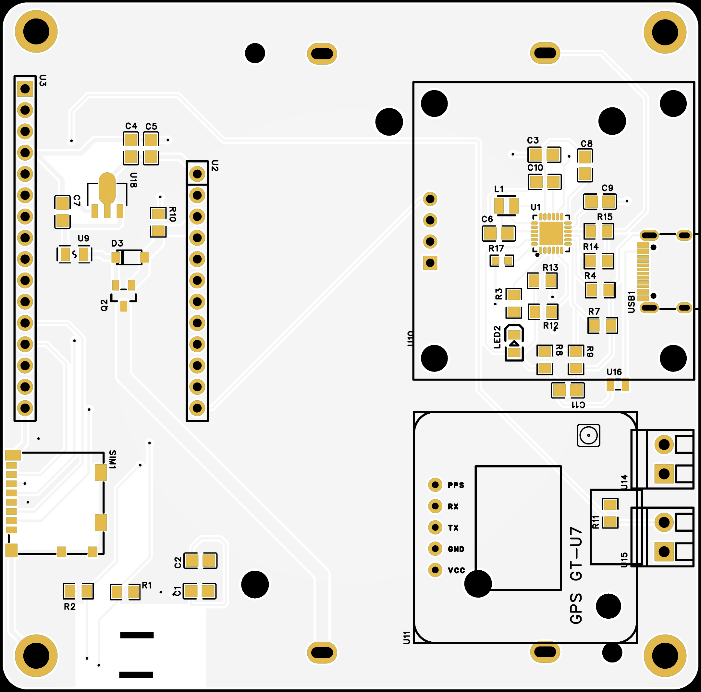
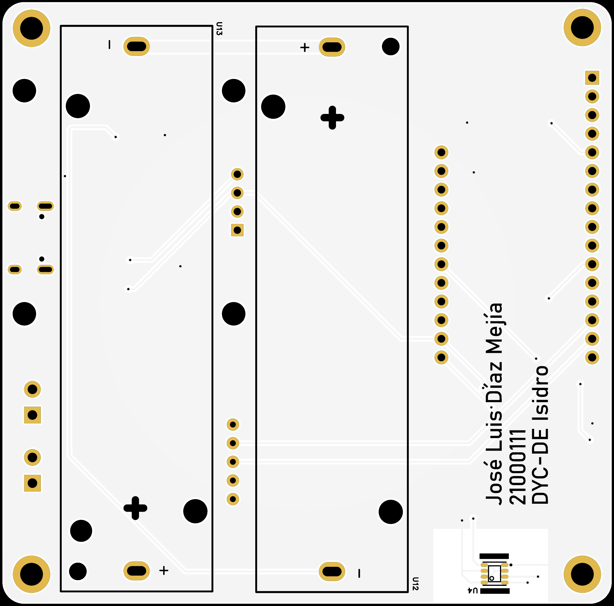
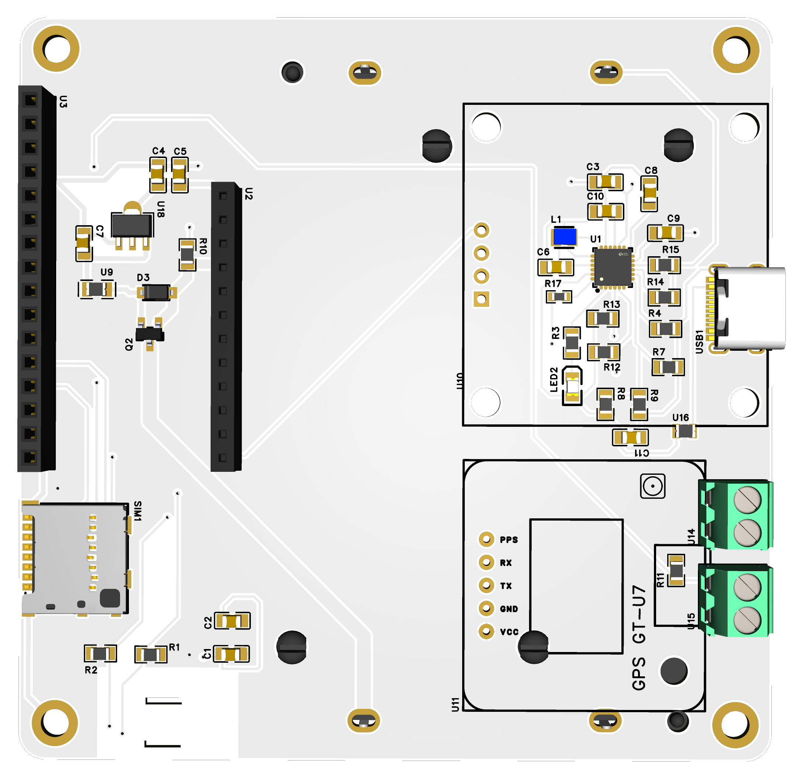
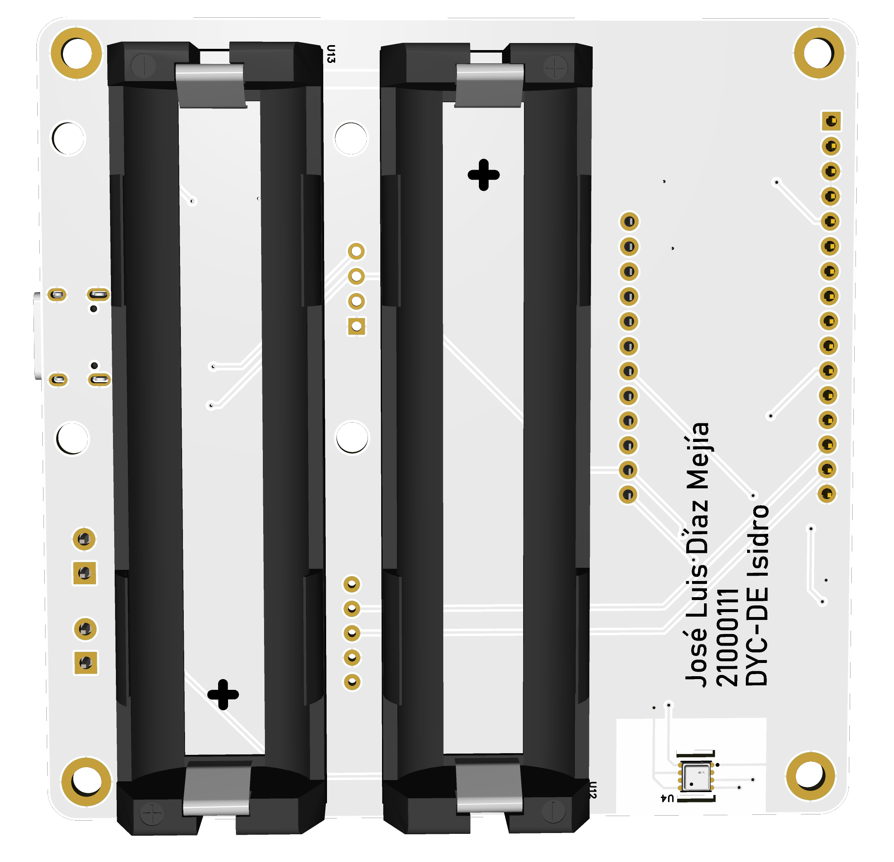

# Data Mules 🚗🛰️

> Sistema móvil y de bajo consumo para el monitoreo ambiental urbano mediante un modelo de comunicación Store–Carry–Forward sobre LoRaWAN.

---

## 📝 Descripción del Proyecto

**Data Mules** es una plataforma de monitoreo ambiental diseñada para recopilar datos clave en entornos urbanos donde la cobertura de red no es continua. El sistema aprovecha la movilidad de vehículos (nodos móviles) para recolectar, almacenar de forma local y reenviar parámetros ambientales cuando se detecta una puerta de enlace (*gateway*) o un nodo cercano.

---

## ✨ Características Generales

* **Modelo de Comunicación:** Basado en *Store–Carry–Forward* (Almacenamiento, transporte y reenvío).
* **Protocolo Inalámbrico:** Cobertura oportunista mediante LoRaWAN / LoRa P2P.
* **Bajo Consumo:** Optimizado para funcionar de forma autónoma con baterías o energía cosechada.
* **Parámetros Medidos:** Temperatura, humedad y calidad del aire.
* **Almacenamiento Local:** Memoria no volátil integrada para retener mediciones sin conexión.

---

## 🛠️ Componentes Principales

| Componente | Función |
| :--- | :--- |
| BastWAN | Microcontrolador principal con comunicación LoRa |
| BME680 | Sensor ambiental de temperatura, humedad, presión y gases |
| GT-U7 GPS | Módulo de geolocalización GPS |
| OLED HS13L03B2C01 | Pantalla I2C para visualización local |
| Lector MicroSD (1040310811) | Almacenamiento local de datos |
| BQ25887 | Cargador de baterías Li-Ion (2S) |
| AMS1117-5.0 | Regulador de voltaje a 5V |
| DS18B20 | Sensor de temperatura externa |
| Baterías 18650 | Fuente de energía del sistema |
| Puerto USB-C | Interfaz de alimentación y carga |

---

## 📌 Asignación de Pines

| Módulo / Periférico | Pin del Componente | Pin BastWAN | Protocolo / Función |
| :--- | :--- | :--- | :--- |
| **BME680** | SDA | SDA (U2-12) | Bus I2C |
| | SCL | SCL (U2-11) | Bus I2C |
| **OLED HS13L03B2C01** | SDA | SDA (U2-12) | Bus I2C |
| | SCL | SCL (U2-11) | Bus I2C |
| **BQ25887** | SDA | SDA (U2-12) | Bus I2C |
| | SCL | SCL (U2-11) | Bus I2C |
| **GT-U7 GPS** | TXD | RX (U3-14) | UART RX |
| | RXD | TX (U3-15) | UART TX |
| **Lector MicroSD** | SCK (CLK) | SCK (U3-11) | SPI Clock |
| | DAT0 (DO) | MISO (U3-13) | SPI MISO |
| | CMD (DI) | MOSI (U3-12) | SPI MOSI |
| | CD/DAT3 (CS) | Pin 10 (U2-7) | SPI Chip Select |
| **DS18B20** | DATA | Pin A0 (U3-5) | 1-Wire / GPIO |

---

# 🖨️ Diseño de PCB

<table>
  <tr>
    <th>TOP view 2D</th>
    <th>BOTTOM view 2D</th>
  </tr>
  <tr>
    <td align="center">
      
    </td>
    <td align="center">
      
    </td>
  </tr>
</table>

<table>
  <tr>
    <th>TOP view 3D</th>
    <th>BOTTOM view 3D</th>
  </tr>
  <tr>
    <td align="center">
      
    </td>
    <td align="center">
      
    </td>
  </tr>
</table>

---

## 🛡️ Certificación OSHW

Este proyecto cumple con la definición de **Hardware de Código Abierto (OSHW)** y está certificado por la *Open Source Hardware Association (OSHWA)*.

* **UID de Certificación OSHWA:** `[ej. ES000001]`
* **Enlace al Registro Oficial:** [Ver Certificación en OSHWA](https://certification.oshwa.org/)

---

## 📜 Licencias

Este proyecto utiliza licencias de código abierto independientes para software y hardware:

* **Hardware:** [CERN-OHL-P-2.0](https://cern-ohl.web.cern.ch/) *(o la licencia de HW que elijas, ej. CC-BY-SA 4.0)*.
* **Software / Firmware:** [MIT License](LICENSE-MIT) *(o GPLv3, Apache 2.0)*.
* **Documentación:** [CC-BY-4.0](https://creativecommons.org/licenses/by/4.0/).
